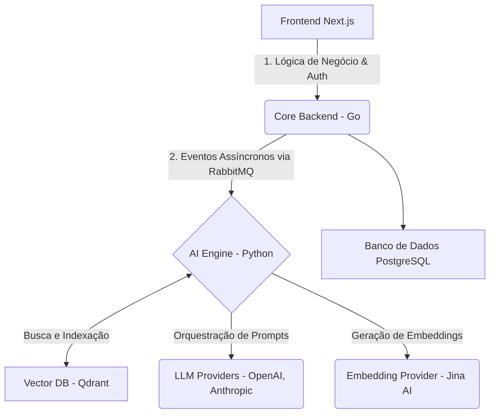
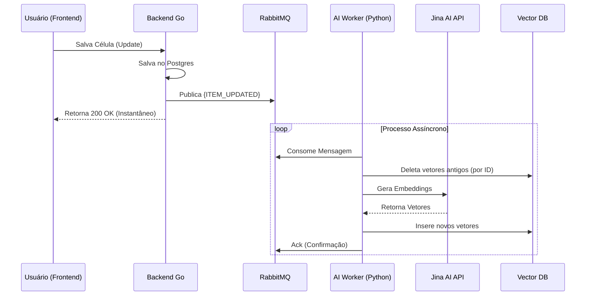
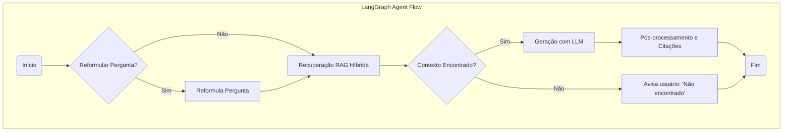

# Documento Técnico Detalhado: Snack Prompt 3.0

## 1. Visão Geral e Arquitetura do Sistema

O Snack Prompt 3.0 evolui de um simples repositório de prompts para uma robusta Plataforma de Inteligência Corporativa e Marketplace de Agentes. A arquitetura foi desenhada para ser escalável, resiliente e segura, utilizando um padrão de **Microserviço Sidecar** para integrar a nova camada de Inteligência Artificial (IA) com o backend legado.

- **Core Backend (Legado - Go):** Permanece como a "Fonte da Verdade", gerenciando usuários, autenticação, pagamentos, e o CRUD de entidades de negócio no banco de dados PostgreSQL.
- **AI Engine (Novo - Python):** Um serviço dedicado e desacoplado, focado exclusivamente em processamento vetorial, orquestração de LLMs, e a lógica de agentes inteligentes.

### Diagrama de Arquitetura de Alto Nível

O diagrama abaixo ilustra a interação entre os componentes principais do sistema. A comunicação entre o Core Backend e o AI Engine é assíncrona, baseada em eventos, para garantir desacoplamento e escalabilidade.

## 2. Stack Tecnológica e Justificativas

A seleção da stack foi guiada por performance, escalabilidade e time-to-market.

| Componente | Tecnologia Escolhida | Justificativa Principal |
| :--- | :--- | :--- |
| **Vector Database** | **Qdrant** | Escrito em Rust, otimizado para filtragem de metadados em alta velocidade e busca híbrida (densa + esparsa), essencial para RAG corporativo. |
| **Embedding Model** | **Jina Embeddings v3** | Modelo SOTA (Estado da Arte) open-source e multilíngue, com suporte a "Matryoshka Representation" para otimização de custo e armazenamento. |
| **Data Pipeline (ETL)** | **LlamaIndex + Docling** | LlamaIndex para parsing hierárquico de dados estruturados (JSON) e Docling (IBM) para extração de layouts complexos de PDFs e DOCX. |
| **Agent Runtime** | **LangChain (LangGraph)** | Utiliza uma Máquina de Estados para criar agentes com lógica complexa (loops, auto-correção) e gerenciar memória em conversas longas. |
| **Message Broker** | **RabbitMQ** | Padrão de indústria para arquiteturas orientadas a eventos, garantindo entrega de mensagens, retentativas automáticas e resiliência. |

## 3. Sincronização de Dados: Arquitetura Orientada a Eventos

A consistência entre o banco de dados primário (Postgres) e o banco vetorial (Qdrant) é crítica. Utilizamos uma arquitetura orientada a eventos para garantir que o processo de embedding (lento e pesado) ocorra em segundo plano, sem impactar a experiência do usuário.

### Fluxo de Sincronização

1.  **Ação do Usuário:** Um usuário edita e salva uma célula em uma tabela no frontend.
2.  **Persistência:** O Backend Go salva a alteração no PostgreSQL.
3.  **Publicação do Evento:** Imediatamente após o commit, o Go publica uma mensagem no RabbitMQ (ex: `ITEM_UPDATED`).
4.  **Consumo do Evento:** Um worker do AI Engine (Python) consome a mensagem da fila.
5.  **Processamento e Indexação:** O worker processa o conteúdo, gera o embedding via Jina AI, e atualiza o registro no Qdrant.
6.  **Tratamento de Falhas:** Em caso de erro, o RabbitMQ gerencia retentativas e move a mensagem para uma Dead Letter Queue (DLQ) para análise, garantindo que nenhum dado seja perdido.

### Diagrama de Sequência da Sincronização

## 4. Modelagem de Dados e Contratos de API

### Modelagem de Dados (PostgreSQL)

Novas entidades são introduzidas para suportar os Agentes e o Marketplace:

- **`agents`**: Armazena a configuração do agente, incluindo o `system_prompt` (encriptado), visibilidade, e preço em créditos.
- **`agent_knowledge_links`**: Tabela de junção que conecta um agente a uma ou mais tabelas de conhecimento.
- **`wallets` & `transactions`**: Gerenciam o saldo de créditos dos usuários e o log imutável de todas as transações.

### Contrato de API (Chat Streaming)

O endpoint de chat (`POST /api/chat/completions`) utiliza Server-Sent Events (SSE) para uma experiência de streaming em tempo real.

- **Request:** Inclui o `agent_id`, o histórico de mensagens, e opcionalmente, tabelas do usuário para o RAG Híbrido.
- **Response:** Um fluxo de eventos, incluindo `token` (para o texto sendo gerado), `citation` (para as fontes), e `done` (para finalizar a interação e informar o custo).

## 5. Lógica do Agente: O Cérebro com LangGraph

O LangGraph permite a criação de um fluxo de decisão não-linear para os agentes.

### Fluxo de Decisão do Agente (MVP)

1.  **Início:** Recebe a pergunta do usuário.
2.  **Reformulação da Pergunta (Opcional):** A IA melhora a pergunta para otimizar a busca vetorial.
3.  **Recuperação Multi-Salto (RAG Híbrido):** O sistema consulta o Qdrant, buscando simultaneamente na base de conhecimento do criador do agente e na base de conhecimento do usuário.
4.  **Geração da Resposta (LLM):** O modelo de linguagem recebe o prompt do sistema, o histórico da conversa e os trechos de contexto recuperados para formular a resposta.
5.  **Pós-processamento:** O sistema formata as citações e prepara a resposta final para o frontend.

### Diagrama do Fluxo Lógico do Agente

## 6. Arquitetura de Segurança: O "Proxy Blindado"

A proteção da propriedade intelectual dos criadores de agentes é fundamental. O fluxo "Proxy Blindado" garante que o `system_prompt` e a base de conhecimento proprietária nunca sejam expostos ao usuário final.

1.  **Request:** O cliente chama a API do Snack Prompt (Backend Go).
2.  **Validação (Go):** O backend verifica a autenticação, autorização (se o usuário comprou o agente) e o saldo de créditos.
3.  **Execução Segura (Python):** O Go repassa a requisição para o AI Engine. O Python recupera o prompt do sistema (descriptografado em memória), utiliza a chave de API da plataforma (não a do usuário) para chamar o LLM, e retorna *apenas* a resposta final.
4.  **Faturamento (Go):** O AI Engine informa ao Go o consumo de tokens, que por sua vez debita os créditos da carteira do usuário.

Este mecanismo garante que o usuário consuma a inteligência do agente sem nunca ter acesso à sua "fórmula secreta".
